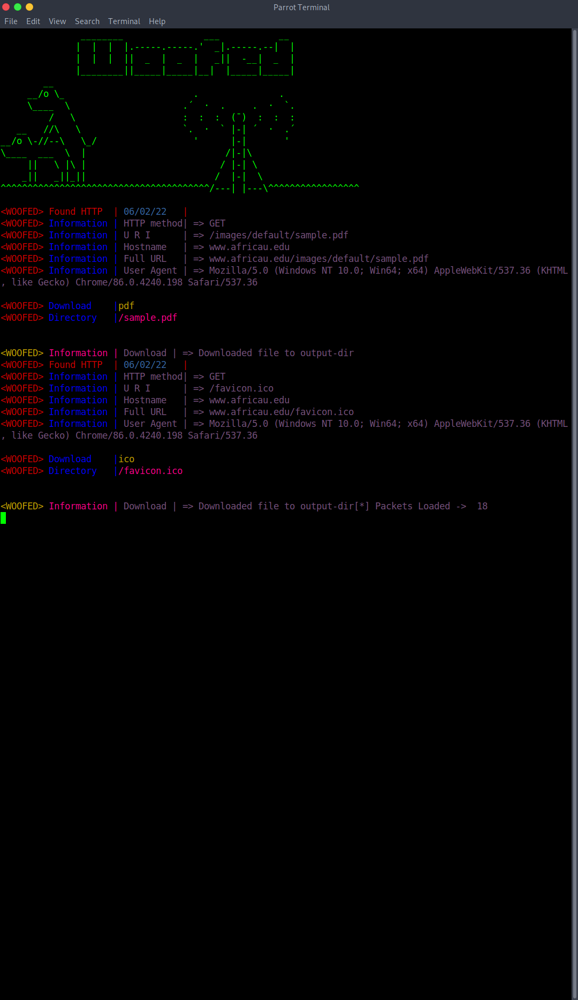

```
 ______ ______ ______    ____   ____                    ______                    __              
|  __  |      |__    |  |_   | |_   |       ______     |   __ \.---.-.----.-----.|__|.-----.-----.
|  __  |  --  |    __|__ _|  |_ _|  |_     |______|    |    __/|  _  |   _|__ --||  ||     |  _  |
|______|______|______|__|______|______|                |___|   |___._|__| |_____||__||__|__|___  |
                                                                                           |_____|
                                                                                                  
                                                                                                  
                                                                                                  
                                                                                                  
                                                                                                  
 ________               ___                                                                       
|  |  |  |.-----.-----.'  _|.-----.----.                                                          
|  |  |  ||  _  |  _  |   _||  -__|   _|                                                          
|________||_____|_____|__|  |_____|__|                                                            
                                          
```

This project is apart of red rabbits soon to be released rewrite, as apart of the 802.11 modules, WOOFED allows you to input a pcap file like pcapng, or .pcap files and parse them. The only function in woofed right now is a function that allows you to search through thousands of packets in seconds to find all files out of the following list 

```cpp
    "pdf",
    "gif",
    "jpg",
    "jpeg",
    "webp",
    "bmp",
    "mp4",
    "docx",
    "mp3",
    "ico",
    "tiff",
    "svg",
    "apng",
    "avif",
    "pjp",
    "pjpeg",
    "jfif",
    "cur",
    "tif",
    "heic",
    "hevc";
```

if the file is found in the URL's extension it will download the file and output it to the directory `output-dir`

# system support 

Debian based systems currently are the only ones supported for this tool THAT ARE KNOWN but the files should work properly on any other system 

# install 

```
git clone https://www.github.com/ArkAngeL43/Woofed.git ; chmod +x ./install.sh ; ./install
```

# Usage 


```
./main path/to/pcap/file.pcap
```

NOTE: if you want to test this tool out there are example files in the examples directory



